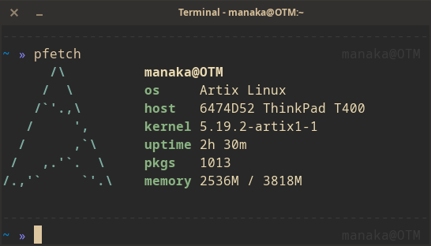

# manaka important commands

  

This is a repo where I will upload some commands and utilities I use on a daily basis and that don't serve any external purpose for the common user. They might be useful for people who lack the scripting knowledge and are looking for help online nonetheless.

If that's the case, I hope you find this repo useful.

## Index

- [ffmpeg](ffmpeg/README.md)

