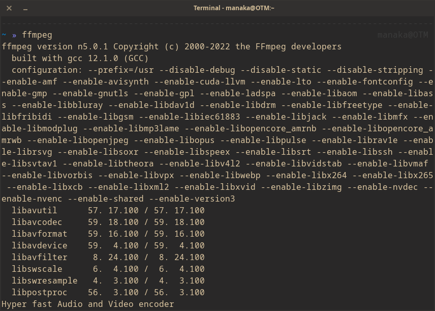

[..](../README.md)
# ffmpeg commands
This are the commands I commonly use for certain tasks on ffmpeg.

FFmpeg is a FOSS project that contains a suite of programs and libraries for handling and converting audio, video and some other multimedia streams and files.

## index
- [generate a static video from an image & audio source](tutorials/generate_static_video.md)

[donate moneroj](monero:45CQ9mN5FGQGqtjQc7pZP2bbYeLocmZSSduhGiYDd6CUCP38uU8498KFeUWg6B2ureRbQvejPfjDWfa1ycezugEkCWetSVA)